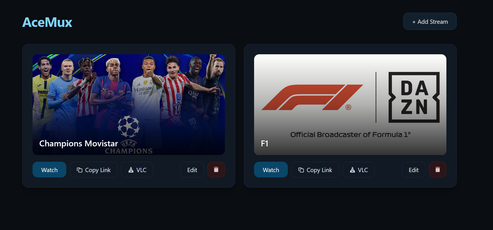

# AceMux

> [!WARNING]  
> This project is currently in beta stage. Many features are still under development and may not work as expected. Expect bugs and incomplete functionality.

<div align="center">
  
  
  A modern web application for managing and streaming AceStream content. Built with Astro and SQLite, it provides an elegant interface to organize your streams and watch them directly in your browser or external media players.
</div>


## ✨ Features

- **Stream Management**: Add, edit, and organize your AceStream links in one place
- **Web Player**: Built-in HLS video player for browser-based streaming
- **External Player Support**: Open streams directly in VLC or other compatible players
- **Visual Library**: Add custom thumbnails to your streams for easy identification
- **Fast & Lightweight**: Built with Astro for optimal performance
- **Persistent Storage**: SQLite database ensures your streams are saved locally
- **Modern UI**: Beautiful, responsive interface built with Tailwind CSS
- **Copy Links**: Quick copy functionality for sharing stream links

## 🚀 Quick Start

### Development Setup

1. **Clone the repository**:
```sh
git clone <repository-url>
cd acemux
```

2. **Install dependencies**:
```sh
bun install
```

3. **Configure environment variables** (create a `.env` file):
```env
ACESTREAM_BASE=http://localhost:6878
DB_PATH=./data/db.sqlite
PORT=3000
```

4. **Run in development mode**:
```sh
bun dev
```

5. **Open your browser** and navigate to `http://localhost:3000`

## 📦 Production Build

To build for production:

```sh
bun run build
```

To preview the production build:

```sh
bun run preview
```

## 🐳 Docker

The easiest way to run AceMux is with Docker. The image is available on both Docker Hub and GitHub Container Registry.

### Quick Start

Create a `docker-compose.yml` file with the following content:

```yaml
services:
  acestream:
    image: ghcr.io/martinbjeldbak/acestream-http-proxy:latest
    container_name: acestream
    environment:
      - ALLOW_REMOTE_ACCESS=true
    ports:
      - "6878:6878"
    restart: unless-stopped

  acemux:
    image: ghcr.io/la-lo-go/acemux:latest
    container_name: acemux
    ports:
      - "4321:4321"
    environment:
      - ACESTREAM_BASE=http://acestream:6878
    volumes:
      - acemux_data:/app/data
    depends_on:
      - acestream
    restart: unless-stopped

volumes:
  acemux_data:
```

Start the stack:

```sh
docker-compose up -d
```

Access the application at `http://localhost:4321`

### Available Images

| Registry | Image |
|----------|-------|
| GitHub Container Registry | `ghcr.io/la-lo-go/acemux:latest` |
| Docker Hub | `lalogo/acemux:latest` |

### Environment Variables

| Variable | Default | Description |
|----------|---------|-------------|
| `ACESTREAM_BASE` | `http://localhost:6878` | AceStream Engine URL |
| `PORT` | `4321` | Application port |
| `HOST` | `0.0.0.0` | Host binding |
| `PUID` | `1000` | User ID for file permissions |
| `PGID` | `1000` | Group ID for file permissions |

### Data Persistence

The SQLite database is stored in `/app/data`. Mount a volume to persist your streams:

```yaml
volumes:
  - ./data:/app/data          # Bind mount
  # or
  - acemux_data:/app/data     # Named volume
```

**Note**: When using bind mounts with custom user/group IDs on your host, set the `PUID` and `PGID` environment variables to match your host user to avoid permission issues:

```yaml
environment:
  - PUID=1000
  - PGID=1002
```


## 🗺️ Roadmap

- [x] **HLS Video Player**: Integrated browser-based video player with real-time stats
- [x] **Docker Image**: Official Docker images on Docker Hub and GitHub Container Registry
- [x] **Stream Health Check**: Real-time status indicators showing stream availability
- [ ] **User Authentication**: Implement user accounts and authentication
- [ ] **External Access URL**: Add a toggle for accessing streams via Tailscale or external IP
- [ ] **Search & Filter**: Add search functionality to quickly find streams
- [ ] **Import/Export**: Backup and restore your stream library
- [ ] **Categories/Tags**: Organize streams by sport, league, or custom tags
- [ ] **Favorites**: Mark streams as favorites for quick access
- [ ] **Sort Options**: Sort by name, date added, or custom order
- [ ] **Bulk Actions**: Delete or edit multiple streams at once
- [ ] **Grid/List View**: Toggle between different layout modes
- [ ] **Progressive Web App**: Install as desktop/mobile app

## 📁 Project Structure

```
acemux/
├── src/
│   ├── pages/              # Application routes
│   │   ├── index.astro     # Main stream library page
│   │   ├── [id].astro      # Stream player page
│   │   └── api/            # API endpoints
│   ├── lib/
│   │   ├── db.ts           # Database functions
│   │   └── components/     # Reusable Astro components
│   └── styles.css          # Global styles
├── data/                   # SQLite database storage
└── public/                 # Static assets
```

## 🤝 Contributing

Contributions are welcome! Feel free to:

- Report bugs
- Suggest new features
- Submit pull requests
- Improve documentation

## 📄 License
This project is licensed under the MIT License. See the [LICENSE](LICENSE) file for details.

---

**Note**: AceMux requires a running AceStream Engine to function. Make sure you have it installed and configured before using this application.
