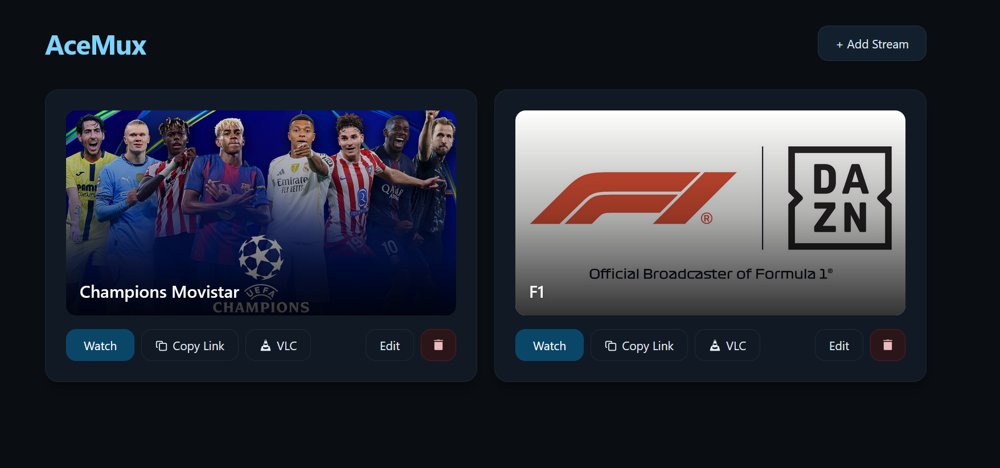

# AceMux

<div align="center">
  

  **AceStream live TV for Plex, Jellyfin, Emby, VLC and the browser.**

  Paste an `acestream://` link and AceMux turns it into a channel: one P2P download
  shared by every viewer, a built-in HDHomeRun tuner, and M3U + XMLTV outputs.
  Single Docker container, no external database.

  [](https://github.com/la-lo-go/acemux/actions/workflows/ci.yml)
  [](https://hub.docker.com/r/lalogo/acemux)
  [](LICENSE)
</div>

## What AceMux does

- **AceStream-native**: add channels by infohash or `acestream://` link — no IPTV subscription or external playlist source needed.
- **Plex Live TV & DVR**: AceMux is its own virtual HDHomeRun tuner, so Plex reads the channel lineup and guide directly from it.
- **Jellyfin, Emby, VLC and Kodi**: standard `playlist.m3u` + `xmltv.xml` endpoints with `tvg-id`, `tvg-name`, logos, groups and channel numbers.
- **Built-in web player**: MSE/`mpegts.js` playback with live peers/speed stats, plus copy-link and one-click VLC buttons.
- **One download, many viewers**: a single upstream P2P session per channel is fanned out to Plex, Jellyfin, VLC and the browser; slow clients are isolated.
- **Simple stack**: one AceMux container next to the AceStream engine, SQLite persistence, health endpoint and optional API token. Runs on Linux, NAS, Windows or macOS with Docker.

## Features

- **Visual library**: custom thumbnails, favorites, search, sort, grid or compact table view
- **Bulk actions**: delete or edit many channels at once
- **Stable channel numbering**: persisted, validated and never recycled, so TV clients keep their mapping
- **Import / Export**: back up and restore the whole library as JSON
- **Stream health**: live engine, peer and speed indicators per channel
- **Filler EPG**: an XMLTV guide is generated for every channel, configurable with `EPG_FILLER_DAYS`
- **Progressive Web App**: installable on desktop and mobile
- **Modern UI**: responsive interface built with Tailwind CSS

## Quick Start

The normal way to run AceMux is with **Docker** (Linux, NAS, Windows or macOS); you do not need Bun or Node on the host. The development setup at the bottom is only for contributors.

### Docker

Create a `docker-compose.yml` file with the following content:

```yaml
services:
  acestream:
    image: ghcr.io/martinbjeldbak/acestream-http-proxy:latest
    container_name: acestream
    environment:
      - ALLOW_REMOTE_ACCESS=true
    ports:
      - "6878:6878"
    restart: unless-stopped

  acemux:
    image: ghcr.io/la-lo-go/acemux:latest
    container_name: acemux
    ports:
      - "4321:4321"
    environment:
      - ACESTREAM_ENGINE_URL=http://acestream:6878
      - PUBLIC_BASE_URL=${PUBLIC_BASE_URL:-}
      - ACEMUX_API_TOKEN=${ACEMUX_API_TOKEN:-}
      - EPG_FILLER_DAYS=${EPG_FILLER_DAYS:-2}
      - TZ=${TZ:-UTC}
    volumes:
      - acemux_data:/app/data
    depends_on:
      - acestream
    restart: unless-stopped

volumes:
  acemux_data:
```

Start the stack:

```sh
docker compose up -d
```

Access the application at `http://localhost:4321`.

#### Available Images

| Registry | Image |
|----------|-------|
| GitHub Container Registry | `ghcr.io/la-lo-go/acemux:latest` |
| Docker Hub | `lalogo/acemux:latest` |

<details>
<summary><h4>Environment Variables</h4></summary>

Only `ACESTREAM_ENGINE_URL` is relevant to get started; every other variable is optional and has a sensible default.

| Variable | Default | Notes |
|----------|---------|-------|
| `ACESTREAM_ENGINE_URL` | `http://acestream:6878` | AceStream engine URL |
| `PUBLIC_BASE_URL` | _(request host)_ | (optional) LAN base URL reachable by Plex/Jellyfin, e.g. `http://192.168.1.100:4321` |
| `ACEMUX_API_TOKEN` | _(open)_ | (optional) token that protects `/playlist.m3u`, `/stream/:id` and `/xmltv.xml` (Plex tuner endpoints cannot send it) |
| `TZ` | `UTC` | (optional) timezone |
| `EPG_FILLER_DAYS` | `2` | (optional) days of filler EPG in the XMLTV guide |
| `HDHR_DEVICE_ID` | _(persisted)_ | (optional) 8-hex HDHomeRun device id presented to Plex; auto-generated and stored per install |
| `MAX_CLIENTS_PER_STREAM` | `6` | (optional) viewers sharing a channel, `0` = unlimited |
| `MAX_CONCURRENT_STREAMS` | `3` | (optional) channels downloading at once, `0` = unlimited |
| `STREAM_STOP_GRACE_MS` | `10000` | (optional) keep an idle session alive before stopping the engine |
| `ACESTREAM_PLAYER_ID` | `acemux` | (optional) player id sent to the engine |
| `PORT` / `HOST` | `4321` / `0.0.0.0` | (optional) server binding |
| `DATABASE_PATH` | `./data/db.sqlite` | (optional) path to the SQLite database |

</details>

## Live TV integration (Plex, Jellyfin, Emby, VLC)

AceMux publishes your library as a **virtual HDHomeRun tuner** and as standard **M3U + XMLTV** endpoints, so your media server shows it as live TV.

| Client | How it connects | Guide |
|--------|-----------------|-------|
| **Plex** (Plex Pass) | HDHomeRun tuner — add AceMux by network address | `http://<IP-LAN>:4321/hdhr/xmltv.xml` |
| **Jellyfin / Emby** | M3U tuner | `http://<IP-LAN>:4321/xmltv.xml` |
| **VLC / Kodi** | Open the M3U playlist directly | `http://<IP-LAN>:4321/xmltv.xml` |

> [!IMPORTANT]
> Set `PUBLIC_BASE_URL` to the LAN address of the host running AceMux (e.g. `http://192.168.1.100:4321`) so the stream URLs are reachable from your players.

### Jellyfin / Emby

Jellyfin and Emby read the M3U playlist and XMLTV guide directly. If you configured `ACEMUX_API_TOKEN`, append `?token=<ACEMUX_API_TOKEN>` to the URLs.

1. Go to **Live TV → Tuner Devices → Add**.
2. Add an **M3U Tuner**:
   ```
   http://<IP-LAN>:4321/playlist.m3u?token=<ACEMUX_API_TOKEN>
   ```
3. Go to **Live TV → TV Guide Providers → Add** and pick **XMLTV**:
   ```
   http://<IP-LAN>:4321/xmltv.xml?token=<ACEMUX_API_TOKEN>
   ```
4. Save and scan. Channels appear immediately and the guide shows the stream name.

### Plex (virtual HDHomeRun tuner)

Plex needs **Plex Pass** and cannot read an M3U directly, so AceMux presents itself as an **HDHomeRun network tuner**. Add it by network address and Plex reads the channel lineup directly, using the numeric channel ids emitted by `/hdhr/xmltv.xml` for the guide.

1. In Plex, go to **Settings → Live TV & DVR → Set Up Plex DVR**.
2. When no tuner is found, use the link to enter the device address manually: `<IP-LAN>:4321` (address only, no path). Plex detects an **HDHomeRun HDTC-2US**.
3. Scan channels. On the guide step, choose **"Have an XMLTV program guide on your server?"** and enter:
   ```
   http://<IP-LAN>:4321/hdhr/xmltv.xml
   ```
4. Review the channel mapping and save. The programme names are the stream names from AceMux.
5. When you add channels in AceMux later, run **Rescan channels** in Plex so the new lineup is picked up.

> [!NOTE]
> The tuner endpoints (`/discover.json`, `/lineup.json`, `/lineup_status.json`, `/device.xml`, `/hdhr/xmltv.xml`) cannot require `ACEMUX_API_TOKEN` because Plex does not send credentials. Expose AceMux only on a trusted LAN, or put it behind a reverse proxy. The regular `/xmltv.xml` and `/playlist.m3u` keep using the token.

### Networking notes

- Every client (Jellyfin, Plex) must be able to reach `PUBLIC_BASE_URL`. On Docker Desktop (Windows/macOS) use the host LAN IP.
- On Linux/NAS the AceStream P2P engine performs better with `network_mode: host`, as it needs incoming peer traffic. Docker Desktop does not support host networking.

## Reference

<details>
<summary><h3>Data Persistence</h3></summary>

By default the SQLite database lives in the `acemux_data` named volume mounted at `/app/data`. Named volumes work the same on Linux, Windows and macOS with no host-side permission setup.

If you prefer a bind mount (easier to inspect/backup), edit `docker-compose.yml`:

```yaml
volumes:
  - ./data:/app/data          # Bind mount
  # or
  - acemux_data:/app/data     # Named volume (default)
```

> [!NOTE]
> On Linux/NAS a bind-mounted `./data` may be owned by `root`. If the container cannot write, run `mkdir -p data && sudo chown -R 1000:1000 data` (the image runs as UID/GID `1000`).

</details>

<details>
<summary><h3>Endpoints</h3></summary>

AceMux exposes its library to external media players:

| Endpoint | Description |
|----------|-------------|
| `GET /playlist.m3u` | M3U playlist with `tvg-id`, `tvg-name`, `tvg-logo`, `group-title` and `tvg-chno` attributes |
| `GET /stream/:id` | Stable MPEG-TS stream (the AceStream engine is resolved server-side) |
| `GET /xmltv.xml` | AceMux's own EPG guide in XMLTV format |
| `GET /discover.json` | Virtual HDHomeRun tuner descriptor for Plex |
| `GET /lineup.json` | Virtual HDHomeRun channel lineup for Plex |
| `GET /hdhr/xmltv.xml` | Plex guide (numeric channel ids matching the lineup) |
| `GET /healthz` | JSON status |

The `playlist.m3u`, `stream/:id` and `xmltv.xml` endpoints accept `?token=<ACEMUX_API_TOKEN>`.

</details>

<details>
<summary><h3>Import / Export</h3></summary>

Use **Actions → Export JSON** in the web UI to download your whole library (`acemux-streams.json`), and **Actions → Import JSON…** to restore it or bulk-add channels by pasting JSON (or picking a file). The import dialog also shows the schema with a **Copy** button so you can hand it to an LLM to format a list.

Accepted format (a plain array of streams also works):

```json
{
  "version": 1,
  "streams": [
    {
      "id": "40-char AceStream infohash",
      "name": "Channel name",
      "photo_url": "https://example.com/logo.png",
      "tvg_id": "epg.channel.id",
      "tvg_name": "Channel name for the guide",
      "group_title": "Sports",
      "number": 1,
      "enabled": true
    }
  ]
}
```

Only `id` (a 40-hex infohash, or an `acestream://` link containing one) and `name` are required; the rest is optional. Existing streams with the same `id` are updated.

</details>

<details>
<summary><h3>Concurrency (multiple viewers)</h3></summary>

The AceStream engine **only serves one player per stream**: a second request to the same `id` replaces the first. To support multiple viewers, AceMux keeps **a single upstream download per channel** and fans it out among all clients of `/stream/:id`; the engine session is stopped only when the last client leaves.

- **Same channel, several people**: they all share a single P2P download (Plex, Jellyfin, VLC and the web player). Cap with `MAX_CLIENTS_PER_STREAM`.
- **Different channels**: each one opens its own session, up to `MAX_CONCURRENT_STREAMS`.
- Slow clients are evicted with a bounded buffer so as not to slow down the rest.
- `/healthz` includes `activeStreams` and `sessions` to see the live status.

Details and limitations in [`docs/concurrency.md`](docs/concurrency.md).

</details>

## Development (contributors)

1. Clone the repository:
```sh
git clone <repository-url>
cd acemux
```

2. Install dependencies:
```sh
bun install
```

3. Create a `.env` file (see `.env.example`):
```env
ACESTREAM_ENGINE_URL=http://localhost:6878
DATABASE_PATH=./data/db.sqlite
PORT=4321
```

4. Run in development mode:
```sh
bun dev
```

5. Open `http://localhost:4321`.

Production build:

```sh
bun run build
bun run preview
```

## Roadmap

- [x] **Live Video Player**: browser player (MSE/`mpegts.js`) sharing the stream session with Plex/Jellyfin/VLC
- [x] **Plex HDHomeRun Tuner**: built-in virtual tuner with a numeric XMLTV guide, no extra service
- [x] **Docker Image**: Official Docker images on Docker Hub and GitHub Container Registry
- [x] **Stream Health Check**: Real-time status indicators showing stream availability
- [x] **Search & Filter**: Add search functionality to quickly find streams
- [x] **Import/Export**: Backup and restore your stream library
- [x] **Favorites**: Mark streams as favorites for quick access
- [x] **Sort Options**: Sort by name, date added, or custom order
- [x] **Bulk Actions**: Delete or edit multiple streams at once
- [x] **Grid/List View**: Toggle between different layout modes
- [x] **Progressive Web App**: Install as desktop/mobile app
- [ ] **SSDP Discovery**: announce the virtual tuner on the LAN for zero-config discovery
- [ ] **User Authentication**: Implement user accounts and authentication
- [ ] **External Access URL**: Add a toggle for accessing streams via Tailscale or external IP
- [ ] **Categories/Tags**: Organize streams by sport, league, or custom tags

## Project Structure

```
acemux/
├── src/
│   ├── pages/                  # Web UI, live TV endpoints and API
│   │   ├── index.astro         # Channel library
│   │   ├── [id].astro          # Browser player
│   │   ├── playlist.m3u.ts     # M3U export (Jellyfin, Emby, VLC, Kodi)
│   │   ├── xmltv.xml.ts        # XMLTV guide
│   │   ├── discover.json.ts    #   \
│   │   ├── lineup.json.ts      #    |  virtual HDHomeRun tuner
│   │   ├── lineup_status.json.ts #  |
│   │   ├── device.xml.ts       #   /
│   │   ├── hdhr/xmltv.xml.ts   # Plex guide (numeric channel ids)
│   │   └── api/                # Library import/export, health and testing
│   ├── lib/
│   │   ├── db.ts               # SQLite persistence and stable channel numbering
│   │   ├── hdhr.ts             # HDHomeRun emulation
│   │   ├── server/             # Engine client, shared sessions, auth
│   │   ├── player/             # Browser player (mpegts.js)
│   │   └── components/         # Reusable Astro components
│   └── styles.css              # Global styles
├── data/                       # SQLite database storage
└── public/                     # Static assets
```

## Contributing

Contributions are welcome! Feel free to:

- Report bugs
- Suggest new features
- Submit pull requests
- Improve documentation

## License

This project is licensed under the MIT License. See the [LICENSE](LICENSE) file for details.

---

**Note**: AceMux needs an AceStream engine. The Docker Compose example includes one; if you already run an engine elsewhere, point `ACESTREAM_ENGINE_URL` at it.
